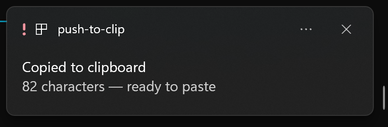

# push-to-clip

Your agent, script, or remote session just produced something you want to paste
somewhere else — now what? `clip.exe` on Windows, `pbcopy` on macOS, `xclip` or
`wl-copy` on Linux (if it's even installed), each with its own encoding quirks —
and none of them tell you whether the copy actually happened.

`push-to-clip` is one tiny, dependency-free command that puts text, files, or piped
output onto your system clipboard on **Windows, macOS, and Linux** — with an optional
desktop toast so you know it worked.

It's the natural companion to [secret-paste](https://github.com/MoritzV42/secret-paste):
where *secret-paste* gets values **into** your AI coding agent without leaking them to the
transcript, `push-to-clip` gets results **out** — so your agent (or any script) can put a
ready-to-paste prompt, snippet, or token straight onto your clipboard.

```bash
push-to-clip "hello world"           # copy a string
echo "$RESULT" | push-to-clip        # copy piped output
push-to-clip --file notes.md         # copy a file's contents
some-command | ptc --quiet           # short alias, no chatter
```

## Why

- **Cross-platform, one command.** No more remembering `clip` vs `pbcopy` vs `xclip` vs `wl-copy`.
- **Zero dependencies.** Pure Python standard library — Win32 clipboard via `ctypes`,
  native helpers on macOS/Linux. Clone and run.
- **Agent-friendly.** Deterministic exit codes and `--json` output make it trivial for an
  AI coding agent or CI step to copy something to *your* clipboard and confirm it.
- **Unicode-safe.** Emoji, umlauts, CJK — all preserved.

## Install

### Option A — let your AI coding agent do it (recommended)
Open [`SETUP.md`](./SETUP.md) and paste it to your agent (Claude Code, Cursor, …). It
detects your OS, installs `push-to-clip`, wires up a clipboard backend on Linux if needed,
and verifies it works — tailored to your machine.

### Option B — manual
```bash
pipx install push-to-clip      # isolated, recommended
# or
pip install push-to-clip
```
On **Linux**, install one clipboard backend once: `wl-clipboard` (Wayland), `xclip`, or `xsel`.

## Usage

| Command | What it does |
|---|---|
| `push-to-clip "text"` | Copy a literal string |
| `cmd \| push-to-clip` | Copy piped stdin |
| `push-to-clip -f FILE` | Copy a file's contents |
| `… \| ptc -q` | Short alias, no stdout confirmation |
| `… \| push-to-clip --json` | `{"ok": true, "chars": N, "source": "stdin"}` |
| `push-to-clip -n …` | Skip the desktop toast |
| `push-to-clip -u …` | Windows 11: urgent toast that breaks through Do Not Disturb |

Exit code is `0` on success, `1` if the clipboard could not be written (with a clear reason).

## How it works

- **Windows** — Win32 `OpenClipboard`/`SetClipboardData` (`CF_UNICODETEXT`) via `ctypes`.
- **macOS** — pipes to `pbcopy`.
- **Linux** — tries `wl-copy`, then `xclip`, then `xsel`.

No network, no telemetry, nothing leaves your machine.

## Desktop toast

After every successful copy, push-to-clip shows a small desktop notification —
so you get visual feedback even when the copy was triggered by a background
script or an AI agent you weren't watching:



- **Windows** — native toast via the bundled `toast.ps1` (Windows PowerShell 5.1 + WinRT).
  The script **self-registers** its AppUserModelId under HKCU on every run
  (idempotent, no admin rights) — without a registered AppId, Windows silently
  drops toast banners. Nothing to set up: the first toast just works.
- **macOS** — `osascript` notification.
- **Linux** — `notify-send`, if present.

The toast is always best-effort: if no notifier is available, the copy still
succeeds. Skip it with `-n` / `--no-toast`.

### Breaking through Do Not Disturb (Windows 11)

While **Do Not Disturb** (or Focus Assist) is on, Windows routes regular toasts
silently into the Notification Center — you never see a banner. Pass
`-u` / `--urgent` to send the toast as an *important notification*
(`scenario="urgent"`): Windows asks once ("Allow important notifications from
push-to-clip?"), and from then on urgent toasts stay visible even during
Do Not Disturb.

### Standalone use & routing line

The bundled script also works on its own, e.g. from agent workflows that want
to tell you *where* clipboard content came from and *what it is for*:

```powershell
powershell.exe -NoProfile -ExecutionPolicy Bypass `
  -File <site-packages>\push_to_clip\toast.ps1 `
  -Title "Copied to clipboard" -Message "Start prompt, 4.6 KB" `
  -Source "Manager chat" -Target "Worker chat" -Urgent
```

`-Source`/`-Target` render as a third line: `From: Manager chat → For: Worker chat`.
The same options are available programmatically via
`push_to_clip.toast.notify(title, message, source=…, target=…, urgent=…)`.

## Troubleshooting

| Symptom | Cause & fix |
|---|---|
| No toast banner on Windows, but copies work | **Do Not Disturb / Focus Assist is on** — banners are silently sent to the Notification Center. Use `--urgent` (one-time "Allow" prompt) or turn off Do Not Disturb. |
| No toast at all on Windows | The toast needs **Windows PowerShell 5.1** (`powershell.exe`). PowerShell 7 (`pwsh`) lacks the WinRT projection — push-to-clip always calls `powershell.exe` for you, but if you invoke `toast.ps1` manually, don't use `pwsh`. |
| Garbled umlauts/emoji when editing `toast.ps1` | The file must stay **UTF-8 with BOM** — PowerShell 5.1 misreads BOM-less UTF-8 as ANSI. |
| No toast on Linux | Install `libnotify` (`notify-send`); the toast is optional by design. |

<!-- PORTFOLIO-LINKS:START -->
## More open-source tools by Moritz Voigt

- **[secret-paste](https://github.com/MoritzV42/secret-paste)** — Paste API keys & tokens to your AI coding agent without ever putting them in the chat transcript. Local-only, cross-platform.
- **[push-to-clip](https://github.com/MoritzV42/push-to-clip)** — Copy text, files, or piped output to your system clipboard, from one command, on any OS. *(this repo)*
- **[memoryball-studio](https://github.com/MoritzV42/memoryball-studio)** — Batch-prep a whole photo folder for the Memory Orb display ball: auto-cropped, face-aware, the right format — locally.
- **[ingpad](https://github.com/MoritzV42/ingpad)** — A patient AI tutor on a canvas: it reads your handwriting, checks every step of a technical exercise, and explains what is missing — solve, don’t copy.
- **[agent-browser](https://github.com/MoritzV42/agent-browser)** — Let your AI coding agent drive your real Chrome — click, fill, screenshot, read the console & network — from any MCP-capable agent.

All free & open source, built in public → **[moritzvoigt.infinityspace42.de](https://moritzvoigt.infinityspace42.de)**
<!-- PORTFOLIO-LINKS:END -->

## License

MIT © Moritz Voigt
